# tea — Techno-Economic Assessment for Process Concepts in the chemical industry

**One methodology, applied identically across many process concepts — so that the
results are comparable, not merely available.**

> [!IMPORTANT]
> ## PRELIMINARY DEV SHOWCASE — VALID SHOWCASE PENDING
>
> This repository presents **one development case**, published to make the core
> workflow visible: case setup, flowsheet import, a single `update()` call, the
> results layer and a parameter sweep.
>
> It is a development case, not a validated assessment. The numbers below
> demonstrate the machinery; they are not offered as a study result. A validated
> showcase is in preparation and will add further assessed cases and the
> generated assessment report.

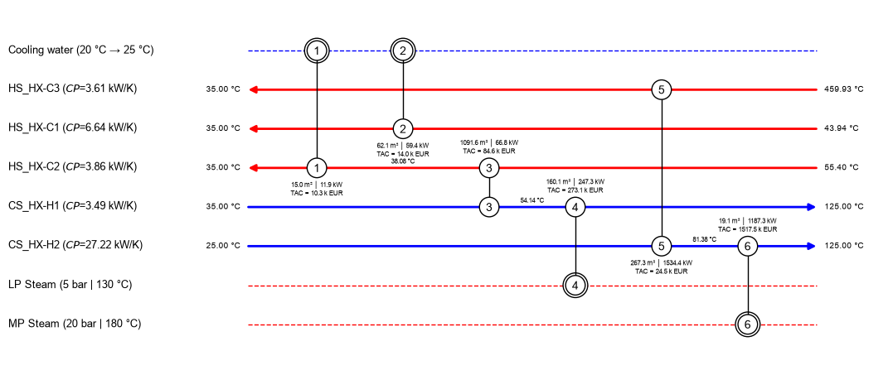

*A heat exchanger network synthesised by the package for the worked case below.
Each match carries its area, duty and annualised cost.*

---

## What it is

A Python package that takes a process concept — streams, equipment, utilities,
scenario assumptions — and produces a costed, discounted-cash-flow assessment,
with heat integration and sensitivity analysis inside the same model rather than
alongside it.

The difficulty in assessing process concepts is rarely the individual
calculation. It is that a comparison across twenty concepts is only meaningful
if all twenty were assessed under the same system boundary, the same cost
correlations, the same index and currency base, and the same discounting
assumptions. `tea` fixes those choices once, at case level, and applies them
identically to every case built on it.

The assessment framework follows the TEA Guidelines for CO₂ utilisation
(Zimmermann et al.). Goal and scope are not documentation — they are structural
elements of the case object, and required for a valid report according to the
TEA guideline levels (`shall` / `should` / `may`).

---

## A worked case

CO₂ pressurization by three-stage compression with intercooling to 308 K. The
flowsheet is solved in DWSIM and imported; everything downstream of the import
is the package.

| | |
|---|---|
| System boundary | Gate to gate, functional unit kt·a⁻¹, TRL 9 |
| Cost basis | EUR, reference year 2026, CEPCI, plant type fluid, Germany |
| Financial assumptions | Interest 20 %, tax 30 %, 1 a investment phase, 10 a production, linear on-ramp |
| Operation | 90 % annual availability, ΔT_min 10 K |
| Equipment | 3 compressors, 3 pressure vessels, heat exchangers from the synthesised network |
| Utilities | Cooling water (20 → 25 °C), grid electricity (25 EUR·MWh⁻¹), LP, MP and HP steam |

### 1 · Setup — assumptions are structure, not prose

Every choice below is an attribute of the case object: typed, unit-carrying,
persisted and reproducible. Nothing here is a comment that a later calculation
could contradict.

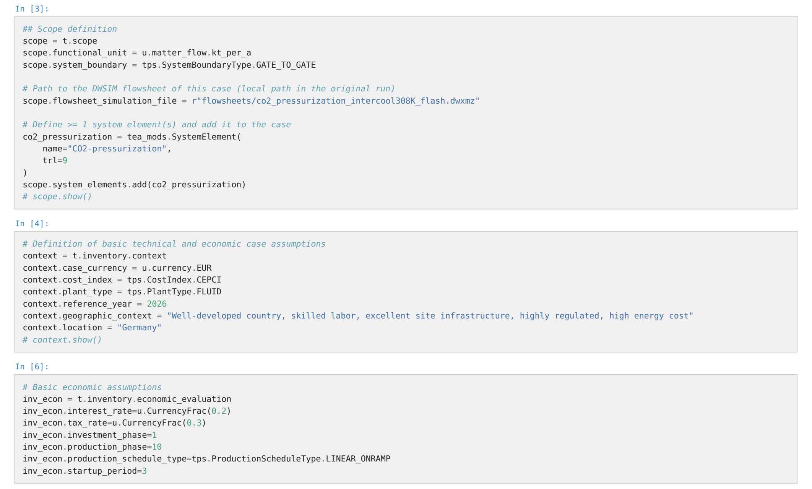

### 2 · What the import puts into the case

This is the source. Three compression stages `C-1`, `C-2`, `C-3` with
intercoolers `HX-C1` to `HX-C3` back to 308.15 K, knockout vessels `B-1` to
`B-3` on the condensate, the product heater `HX-H1` and the water-recovery
exchanger `HX-H2`. One thermal stream per exchanger — five in all — is what
the heat integration in section 5 works on.

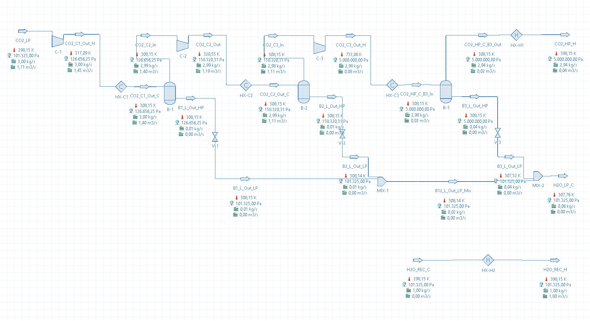

The flowsheet is read once. From that point the case carries the streams, the
unit operations and the compound set as its own inventory — the assessment does
not reach back into the simulator for them. The import states what it did and
what it defaulted:

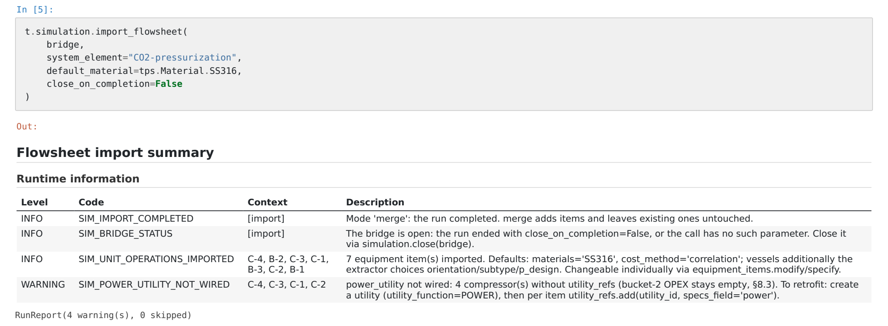

Six equipment items, materials defaulted to SS316, and a warning that the
three compressors carry no power utility yet — wired up in the next cell. A
default is recorded as a default, not applied silently.

**Stream inventory, thermal section.** Every quantity the pinch analysis and the
network synthesis use later is visible here: heat capacity, inlet and outlet
temperature, phase, and whether the stream belongs to the heat-integration pool.
A result without its inventory is a number without a basis.

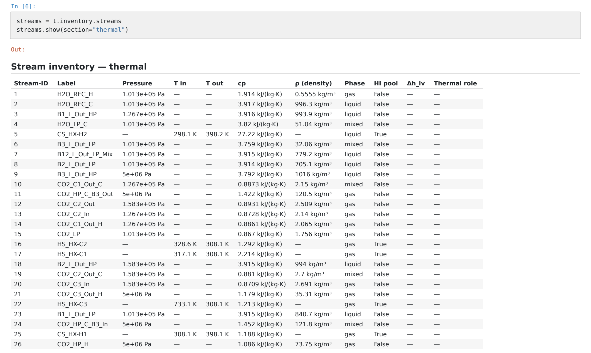

**Equipment inventory.** The sizing inputs per item, and the specification
choices the import made — orientation, design pressure, material. The sizing
outputs are still empty at this point; `update()` fills them, and section 4
costs them.

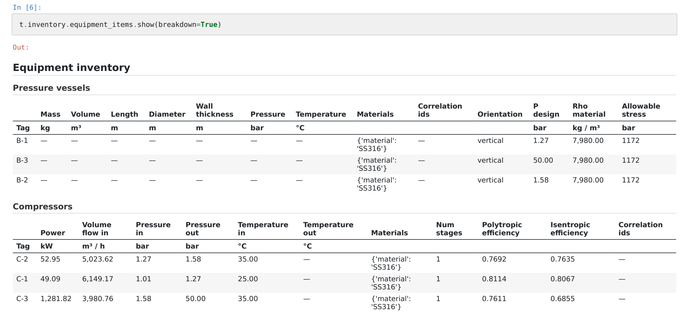

### 3 · One call runs the pipeline

`validate()` checks the case for completeness before anything is computed.
`update()` then runs equipment sizing, cost estimation, pinch targeting, network
synthesis and the cash-flow model. Neither returns a bare number: `validate()`
reports 0 errors against 14 warnings, `update()` a run report over 9 entries —
and one result it declined to compute rather than compute wrongly. Every error
and every warning carries its context and the issue it names; the lists
themselves are omitted here.

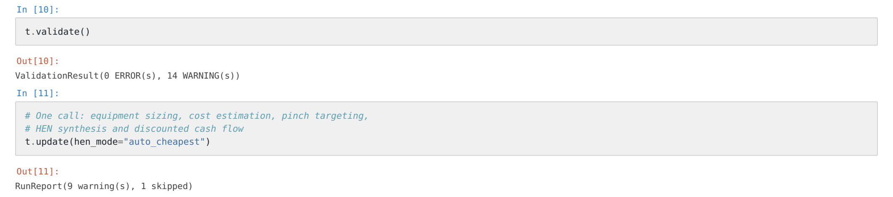

### 4 · Results carry their own derivation

`breakdown=True` decomposes a number down to the line items and the applied
factors, so an estimate can be traced back to its basis rather than taken on
trust.

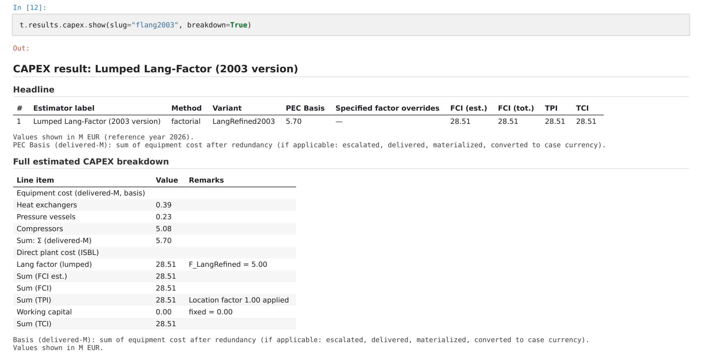

Delivered equipment cost of 5.70 M EUR — dominated by the compressor train at
5.08 M EUR — becomes 28.51 M EUR of total capital investment under the refined
Lang factor of 5.00. This is the initial flowsheet configuration only: the
configuration is a variable of the study, not a fixed input.

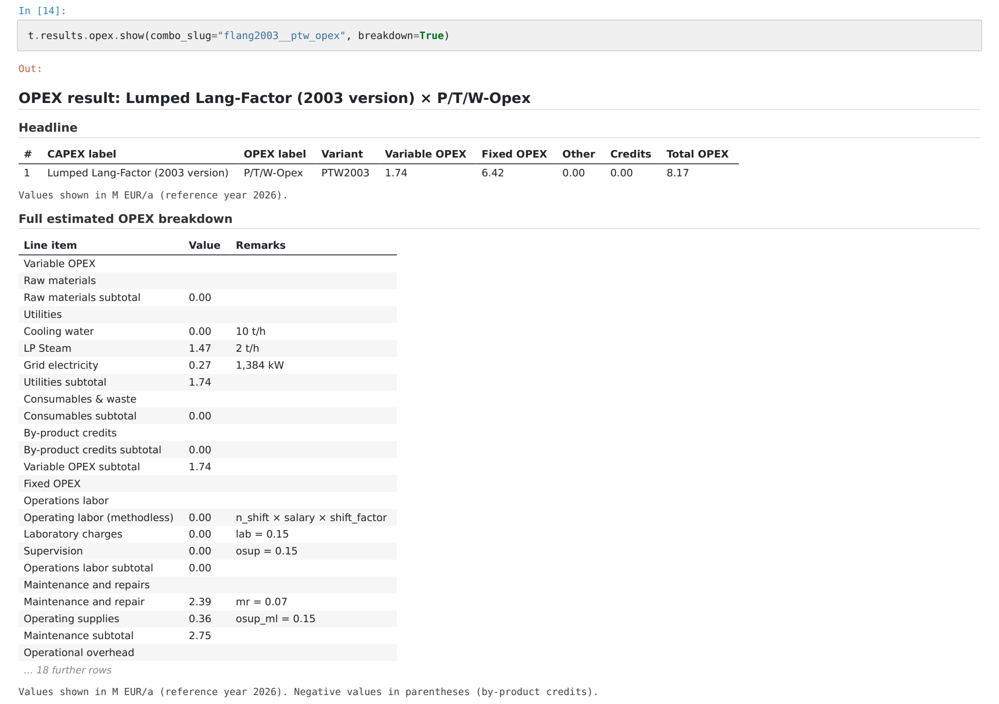

### 5 · What heat integration scenarios are worth here

All four scenarios are synthesised against **the same imported flowsheet
solution** and the same pinch scenario. The process is held fixed here; what
varies between them is the exchanger minimum approach temperature and whether
intermediate utility levels may be used. (The table below shows no pinch
scenario for the third: it recovered nothing, so no network was realised against
one.) The comparison therefore isolates the
network decision from the process decision, which is a separate question and
belongs to the sensitivity layer.

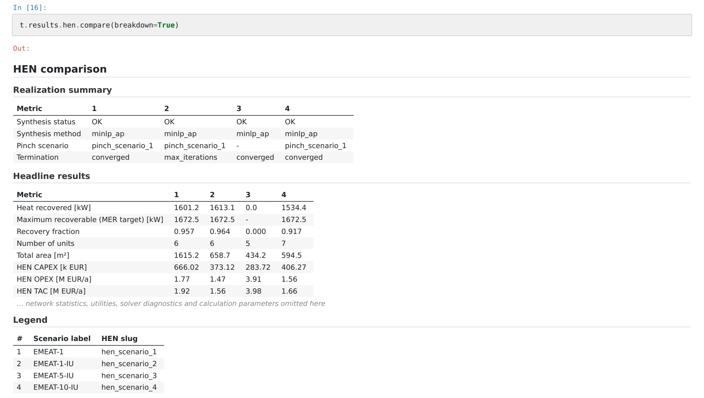

Two numbers come out of this, and they answer different questions.

**What integration is worth at all.** Three of the four syntheses produce a
heat-recovering network at 1.52 to 1.76 M EUR·a⁻¹ total annualised cost. The
third, at EMAT 5, recovers nothing and lands on 3.98 M EUR·a⁻¹ — which is
exactly the un-integrated baseline the utility pool computes independently. The
gap between the best network and that baseline is **2.46 M EUR·a⁻¹**.

**What the choice of network is worth.** Among the three that do recover heat,
0.24 M EUR·a⁻¹ separates best from worst — and it is not the network you would
pick by looking at capital cost:

| | EMEAT-1 | EMEAT-1-IU |
|---|---|---|
| Heat recovered | 1,652 kW | 1,613 kW |
| Total area | 712 m² | 659 m² |
| Network capital cost | 390 k EUR | 373 k EUR |
| Utility cost | 1.43 M EUR·a⁻¹ | 1.47 M EUR·a⁻¹ |
| **Total annualised cost** | **1.52 M EUR·a⁻¹** | 1.56 M EUR·a⁻¹ |

**EMEAT-1** — six units, 712 m², 1.52 M EUR·a⁻¹

**EMEAT-1-IU** — six units, 659 m², 1.56 M EUR·a⁻¹

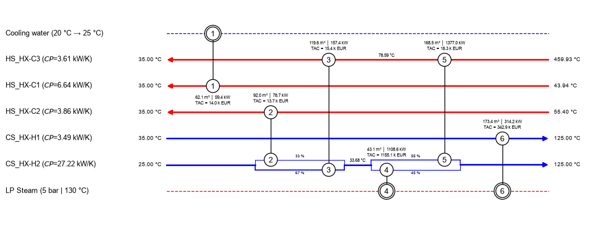

Same approach temperature, six units either way. The first network buys 53 m²
more surface and 17 k EUR more capital to recover 39 kW more heat — and that
trade pays for itself: the utility bill drops by more than the annualised
capital rises, so the more expensive network is the cheaper one. Ranking these
on installed cost, or on recovered duty alone, picks the wrong one. Only the
total annualised cost orders them, and only a synthesis run produces it.

*On the recovery fraction in the table:* the maximum-recovery target is computed
at the pinch scenario's ΔT_min, while the synthesiser works at its own EMAT, so
the two are indicative of each other rather than strictly commensurable. The
costing rests on the synthesised network's own mass and energy balances.

**Reading the termination row.** Neither `converged` nor `max_iterations` is a
verdict on the network. The superstructure these synthesisers optimise has a
non-convex objective, so they are deterministic heuristics with an incumbent
guarantee: whatever ends the search — an exhausted topology space, an iteration
budget, a patience cap on non-improving steps — the best feasible network found
is returned, not the last one. The row names the stop condition; none of these
runs carries a proof of optimality, and `max_iterations` is not a failure.

That is the trade this estimate class accepts: seconds per synthesis instead of
a certificate, which is also what makes synthesis affordable inside a parameter
sweep. [Methodology](docs/methodology.md#heat-integration) states what it costs
and where it stops being acceptable.

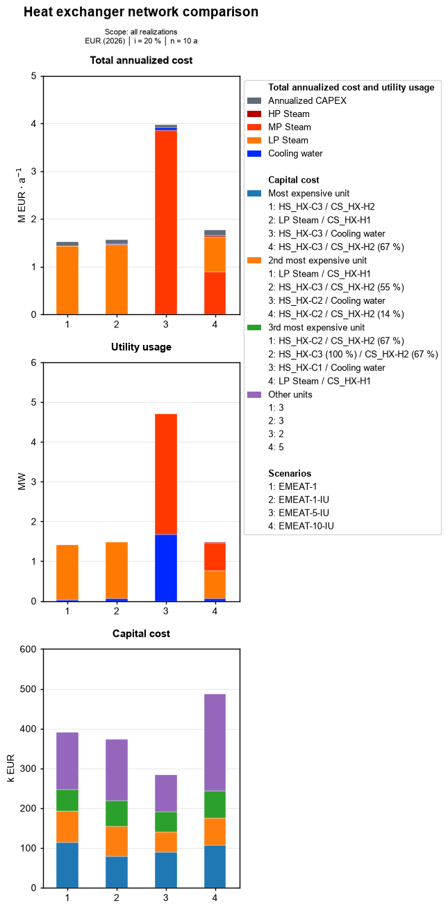

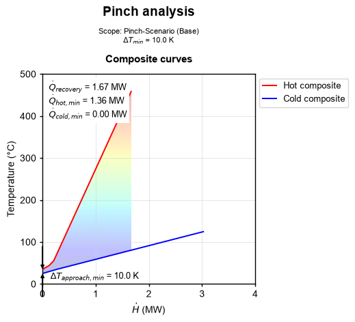

### 6 · Varying the process itself

Section 5 held the flowsheet fixed and varied the network. A sensitivity case
does the opposite — and it does not have to choose a side. One sweep addresses
both halves of the model at once: `flowsheet_parameterset` reaches through the
bridge into the simulator and moves the process, `tea_parameterset` moves the
economic assumptions, and both are traversed on the same grid.

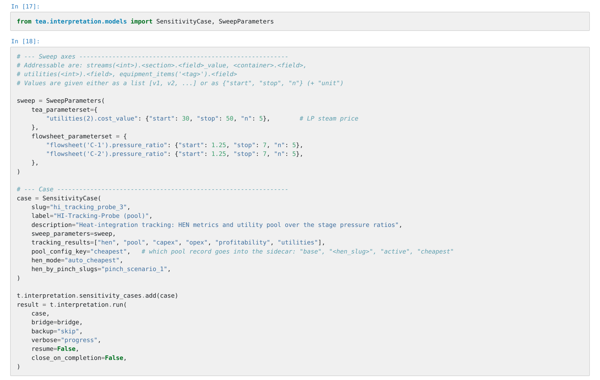

Two stage pressure ratios and the LP-steam price, five values each — 125 points.
At every point the flowsheet is solved and re-imported, the equipment re-sized
and re-costed, the pinch re-targeted and the network re-synthesised. Nothing is
held over from the previous point.

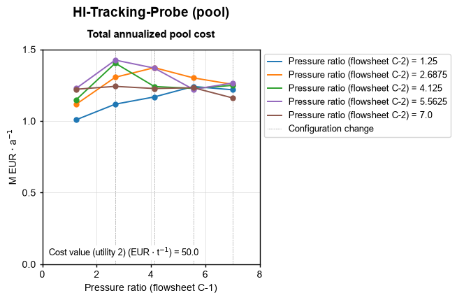

Each curve is one setting of the second stage, the x axis is the first. The
dotted verticals mark where the selected heat-integration configuration changes
— the pressure ratio at which a different network becomes the cheapest one. No
single run shows that; it is the reason to sweep rather than to sample.

> **Note.** This sweep was computed before the flowsheet revision behind the
> results above, so its absolute values are superseded. It is shown for the
> mechanism.

### The full session

**[`examples/co2_pressurization.ipynb`](examples/co2_pressurization.ipynb)** —
case setup, flowsheet import, estimators, heat integration, results and figures,
with the stored outputs. GitHub renders it directly.

The notebook is evidence, not a tutorial: it is not executable outside its
original environment, because the package is pre-release and not distributed
here and the import step needs a local DWSIM file.

---

## Capabilities

Status reflects the code, not the specification. `Partial` names the gap.

| Area | What it does | Status |
|---|---|---|
| **Capital cost** | Factored estimation with three published factor schemes (Lang refined 2003, Lang detailed 2003, Towler & Sinnott 2022); ISBL/OSBL separation where the scheme supports it; working capital by five methods | Implemented — [worked example](#4--results-carry-their-own-derivation) |
| **Operating cost** | Direct and indirect operating cost with three published estimator families (Towler & Sinnott 2022; Peters, Timmerhaus & West 2003; Seider, Lewin & Lewis 2017) | Implemented — [worked example](#4--results-carry-their-own-derivation) |
| **Profitability** | Discounted cash flow — NPV and IRR, MACRS depreciation, tax lag, working-capital recovery | Implemented |
| **Heat integration — targeting** | Pinch analysis: problem-table cascade, composite and grand composite curves, LP transshipment targeting | Implemented — [worked example](#5--what-heat-integration-scenarios-are-worth-here) |
| **Heat integration — synthesis** | Three network synthesisers: MILP transshipment; MINLP stage-wise superstructure (Yee & Grossmann); MINLP with augmented penalty / outer approximation (Viswanathan & Grossmann 1990) | Implemented — [worked example](#5--what-heat-integration-scenarios-are-worth-here) |
| **Utility selection** | Utility pool evaluation against the pinch; no-recovery baseline for comparison | Implemented |
| **Equipment sizing** | Compressor (direct specification), heat exchanger (LMTD shortcut), pressure vessel (Souders–Brown and vessel geometry) | Partial — 4 of 6 methods |
| **Sensitivity analysis** | Multi-dimensional parameter sweeps over persisted scenarios, results retained for comparison | Partial — Monte Carlo not implemented; [worked example](#6--varying-the-process-itself) |
| **Correlation library** | Editable cost-correlation library with correction factors and LaTeX rendering of the stored formula | Implemented |
| **Units and currency** | pint-backed unit system, eight currencies, cost-index escalation (CEPCI as default index) | Implemented |
| **Figures** | Six plot recipes with a notebook mode and a report mode; PNG / PDF / SVG export at fixed physical size | Implemented |
| **Reporting** | Word report at guideline `shall` level | Partial — one profile |
| **Process simulator link** | DWSIM: flowsheet import — streams, unit operations, compounds — and parameter write-back with re-solve inside a sweep | Partial — write-back covers flowsheet parameters, not the full equipment set; DWSIM only. [Worked example](#2--what-the-import-puts-into-the-case) |

---

## Scope and limitations

Stated deliberately, because an assessment method is only useful if its range of
validity is known.

- **Estimate class.** The implemented estimator family is factored estimation,
  valid over TRL 4–6. The package does not attempt vendor-quote accuracy and
  does not carry an equipment price database beyond its correlation library.
- **No life-cycle assessment.** `tea` covers the techno-economic half only. The
  inventory layer — system boundary, mass and energy balances, utility demand —
  is the layer an LCA would build on, but that extension does not exist.
- **Simulator coupling is partial.** A flowsheet can be read, and a sweep can
  write flowsheet parameters back through the bridge and re-solve, as section 6
  does. Write-back covers flowsheet parameters, not the full equipment set, and
  DWSIM is the only backend.
- **Solver.** MILP and LP run on HiGHS as bundled with SciPy; NLP subproblems on
  SciPy. No commercial solver licence is required.

---

## Methodology and architecture

- [Methodology](docs/methodology.md) — assessment framework, cost basis,
  literature sources, what the numbers mean and what they do not.
- [Architecture](docs/architecture.md) — layering, calculation pipeline,
  extension points.

---

## Scale

| | |
|---|---|
| Implementation | 171 modules, ~39,000 lines of code (excluding comments and docstrings) |
| Test suite | 324 test modules |
| Runtime dependencies | pint, pandas, pydantic, python-docx, SciPy, SymPy, matplotlib |
| Python | 3.11+ |

---

## Status and availability

`tea` is in pre-release. The source repository is private while the first
release is being completed, and this repository presents the package rather than
distributing it.

**Source access is available on request** — get in touch and I will add you as a
reader on the private repository.

---

## Contact

<!-- Name, e-mail, ORCID, LinkedIn. -->
